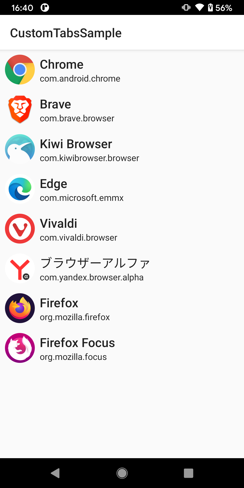
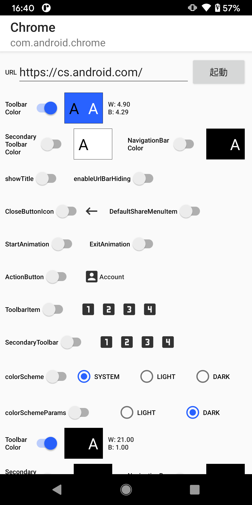
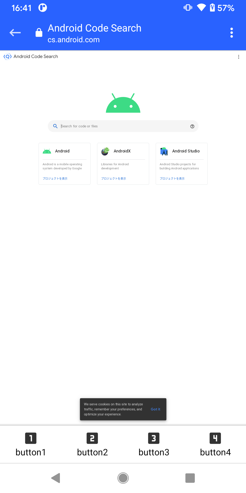

# Dev Tabs Launcher

This app is a launcher for Custom Tabs compatible apps.
https://developer.chrome.com/multidevice/android/customtabs

Custom Tabs is supported by not only Chrome but also other browsers.
This app lists the apps that support Custom Tabs, and can open url by them as Custom Tabs with various options.

||||
|-|-|-|

## Author
大前 良介 (OHMAE Ryosuke)
http://www.mm2d.net/

## License
[MIT License](./LICENSE)
